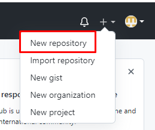
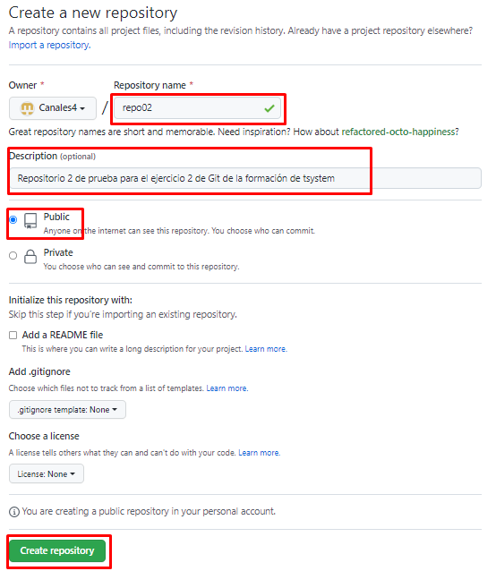

# PASOS A REALIZAR PARA EL EJERCICIO 2
---
## 1. Creamos el repositorio directamente desde GitHub
## 
## 
---
## 2. Nos situamos sobre el directorio donde queremos poner nuestro repositorio.
---
##  3. Y hacemos un  
``` 
git clone https://github.com/Canales4/repo01
```
---
## 4. Añadimos el fichero con touch readme.md y trabajamos sobre el.
---
## 5. Y despues ejecutamos los siguiente commandos
``` 
git add .

git commit -m "primer commit"

git push 
```

# RESUMEN COMANDOS DE GIT  Y APRENDIDOS

## Recogida de los comandos de git aprendidos

```

```